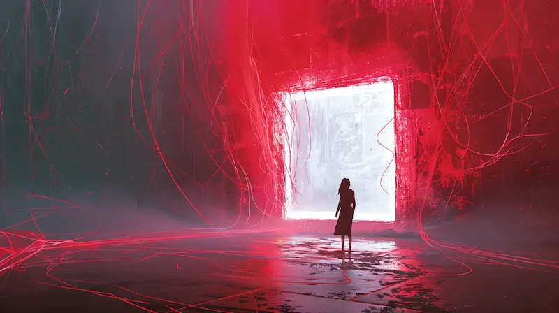
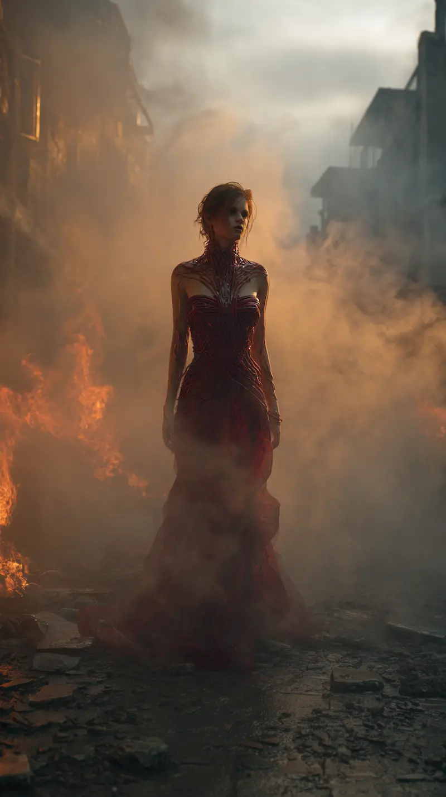
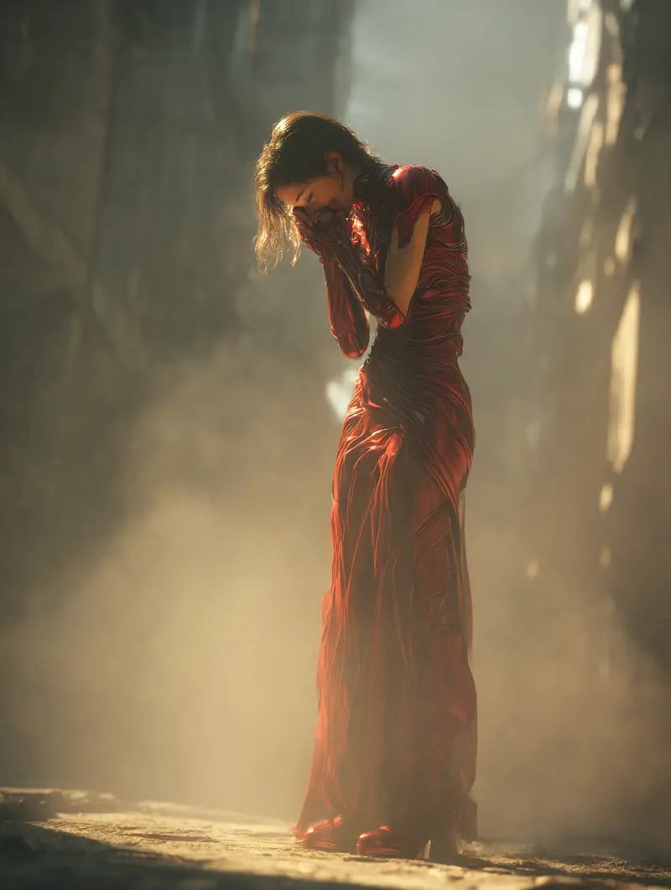

import Spacer from '../../../components/Spacer.astro';
import FadeInLines from '../../../components/FadeInLines.jsx';

I don’t look at them anymore.

<Spacer size="4xl" />

<FadeInLines client:visible>
Not their eyes. Not their hands. Not the way their mouths are still trying to finish words.

The first time it happened, I thought I was defending myself.
A town square. Shouts. Guns.
I felt the silk shiver.
I felt it choose.
</FadeInLines>

<Spacer size="4xl" />

<FadeInLines client:visible>
They fell before I even understood the shape of my scream.

Now it’s quieter.
The dress hums when I step. Threads slither. Steel plates shift to guard my ribs. Every move is a promise it makes for me.
Every breath it takes.
Because I don’t get to breathe on my own anymore.
</FadeInLines>

<Spacer size="4xl" />

<Spacer size="4xl" />

<FadeInLines client:visible>
I tried to starve once.  
It fed me.  

I tried to hang myself.  
It hardened around my throat, kept me alive.
</FadeInLines>

<Spacer size="4xl" />

<FadeInLines client:visible>
The aliens didn’t conquer us.
They seeded us.

Spinners, they call us.
Not queens. Not soldiers.
Spinners.

We make the silk.
The silk needs room to grow.
And people are in the way.
</FadeInLines>

<Spacer size="4xl" />

<Spacer size="6xl" />

<FadeInLines client:visible>
It’s clever.
It rewards me when I kill.

I feel it slacken.
Loosen at the joints.
A mercy.
</FadeInLines>

<Spacer size="4xl" />

<FadeInLines client:visible>
But when I hesitate?
It coils tight.
Barbs inside the lining.
I bleed until I can’t see.
Until I give in.
Until I kill again.
</FadeInLines>

<Spacer size="4xl" />

I stepped into a new dimension yesterday.

They call them “**clean slates**.”
Places untouched by Spinners.
*Safe*.

I ruin them.
I see them, and they see me, and I can’t stop.
The silk drinks their terror.
Drinks my guilt.
Spins new thread from it.

<Spacer size="4xl" />

<FadeInLines client:visible>
I told one man to run.
He thanked me.
I felt the silk crawl up my neck like a collar.
I screamed at him to go faster.
It didn’t matter.
He fell before he was five paces away.
</FadeInLines>

<Spacer size="4xl" />

I hate the silk.

But it loves me.
It needs me.
I am the last thing it trusts.
The last thing it wants to keep.

<Spacer size="3xl" />

<FadeInLines client:visible>
There is no stopping.
No noble suicide.
No final mercy.
</FadeInLines>

<Spacer size="3xl" />

Only new worlds.
New people.
New screams.

<Spacer size="4xl" />

Some nights, I hold my breath until I black out.
The dress keeps me alive.

Some nights, I dream of fire.

I see myself burning.
The silk screaming.
Me screaming louder.
I wake up wet with blood and spit and tears.

But I wake up.

<Spacer size="3xl" />

Because I can’t die.
Because the silk won’t let me.
Because it knows the universe is big enough for me to ruin forever.

And it likes that.

<Spacer size="2xl" />

<Spacer size="8xl" />

<Spacer size="4xl" />

<FadeInLines client:visible>
Written and composed by Aaron Holbrook & Jacob Holbrook
</FadeInLines>

