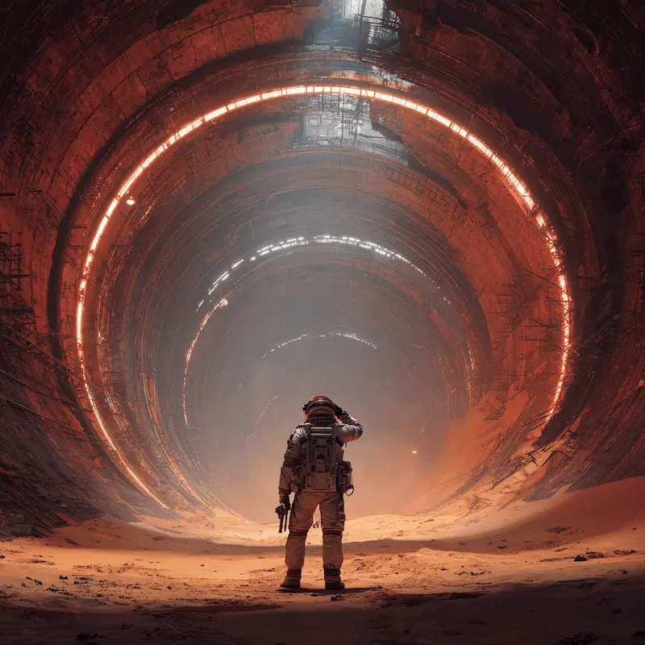
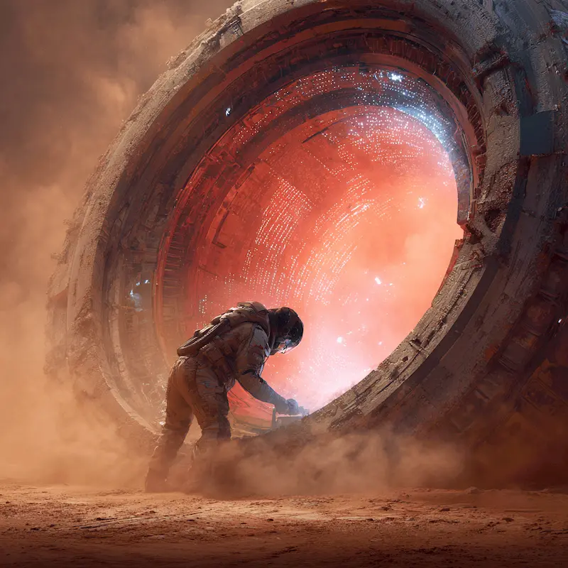
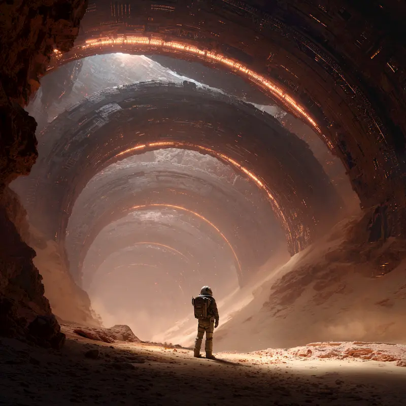

import Spacer from '../../../components/Spacer.astro';
import FadeInLines from '../../../components/FadeInLines.jsx';

**Part I: Preface**

<Spacer size="2xl" />

<FadeInLines client:visible>
---
> **Unknown Channel: Secure Thread // Layered Consensus (4 Voices Active)**

**Kerran:** She’s returned to Node 7-Theta. That’s three nights in succession.

**Isel:** Pattern formation. Early. Intentional. She’s listening again.

**Vey:** The rhythms near her sector are stabilized. She may be reinforcing them.

**Mira:** She’s not just listening. She’s *feeling*.

**Kerran:** Others have felt.

**Mira:** Not like this.

**Isel:** She’s lonely. That helps.

**Vey:** Loneliness makes room.

**Kerran:** The Deep have begun low-pulse construction across the Western Conduit.

**Isel:** Their harmonics are tightening. If she intervenes—

**Vey:** She won’t. Not yet.

**Mira:** But she could.

**Isel:** If she aligns.

**Kerran:** If we guide, subtly.

**Vey:** She’s the best option we’ve had in seventy-four cycles.

**Mira:** And possibly the last.

---
</FadeInLines>

<Spacer size="2xl" />

<FadeInLines client:visible>

</FadeInLines>

<Spacer size="2xl" />

<FadeInLines client:visible>
I don’t dream the way I used to.

There was a time—before the storms came closer, before the metal screamed under my hands—when I’d dream in color. Rolling orchards, yellow suns, breath that came easy.

Now when I sleep, I hear them.

Not words. Not even sounds, really.

Just tension. Just pressure. Like a tight string under a bow, waiting for a note that never comes.
</FadeInLines>

<FadeInLines client:visible>
I keep telling myself it’s just residual energy from the transmission towers. The old infrastructure still leaks, warbles. The harmonics aren’t always balanced. Everyone hears it. The engineers chalk it up to grounding issues, tectonic bounce, maybe something in the soil.

But I know better. I *feel* better.

Not *better*, exactly—just… differently.
</FadeInLines>

<FadeInLines client:visible>
More attuned.

More cracked open.
</FadeInLines>

<FadeInLines client:visible>
They don't like that about me. The others. They don't say it. But they flinch when I walk in a room. They call me a sensor tech, but they mean it like a curse. Like it's my fault I hear what I do.
</FadeInLines>

<FadeInLines client:visible>

</FadeInLines>

<FadeInLines client:visible>
My name’s Juno Halvek.

I keep things from falling apart.

I weld fractures. I realign magnetic sheaths. I restore harmony between machines that were already old when my grandmother was a child.
</FadeInLines>
<FadeInLines client:visible>
That’s the official job description, anyway.

What I *actually* do is wander out into the red, dry night, where the sand carves ridges into steel, and I listen. To the hum. To the pulse. To the ache in the metal.
</FadeInLines>
<FadeInLines client:visible>
Something's waking up under this planet.

And it's been watching me.
</FadeInLines>

<Spacer size="2xl" />

<FadeInLines client:visible>

</FadeInLines>

<Spacer size="4xl" />

---

## This isn't the end.
The storm still waits.
The Deep still stirs.

Juno’s journey is just beginning.

Sign up below to be the first to know when the next chapter of The Machine’s Prayer is released.

You’ll get early access, behind-the-scenes lore, and quiet echoes from the Calm.