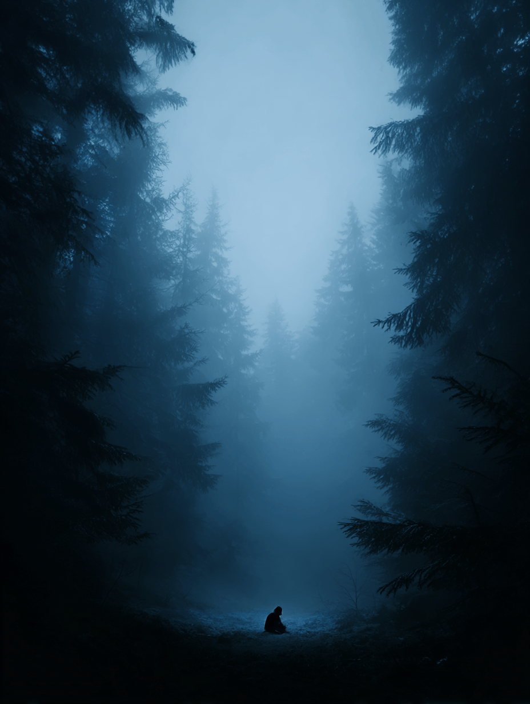
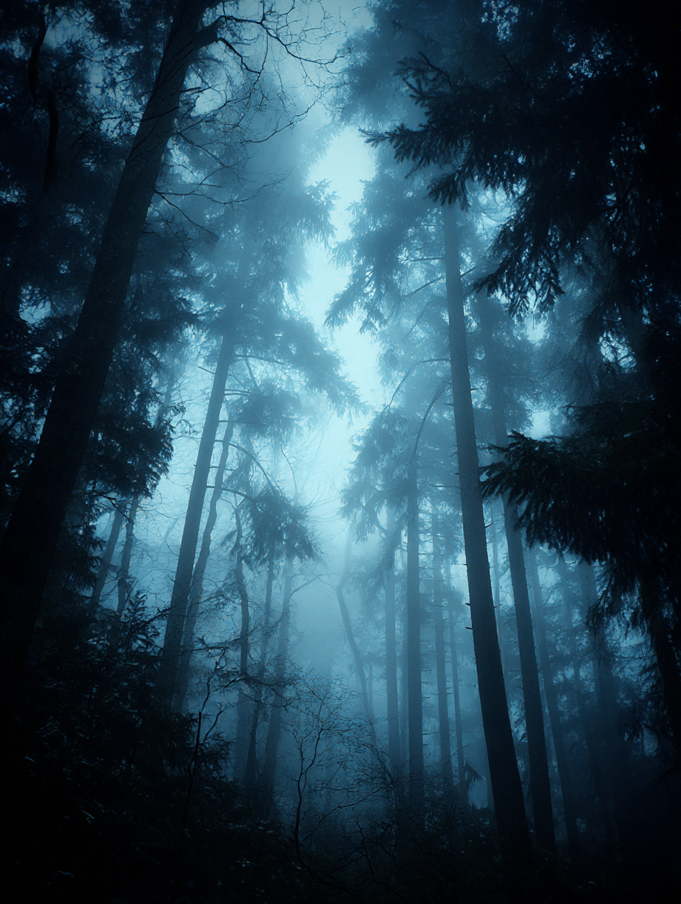
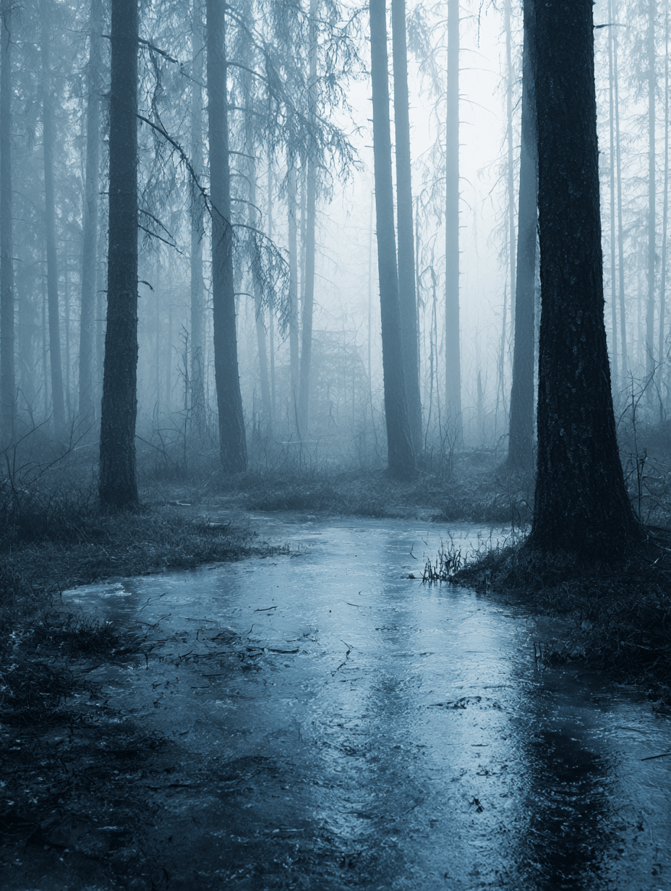
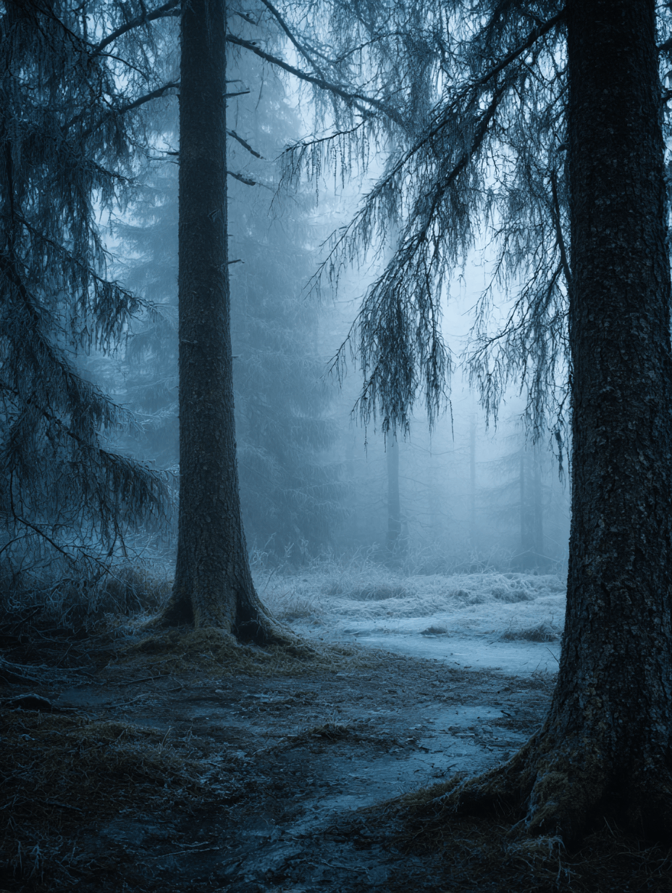
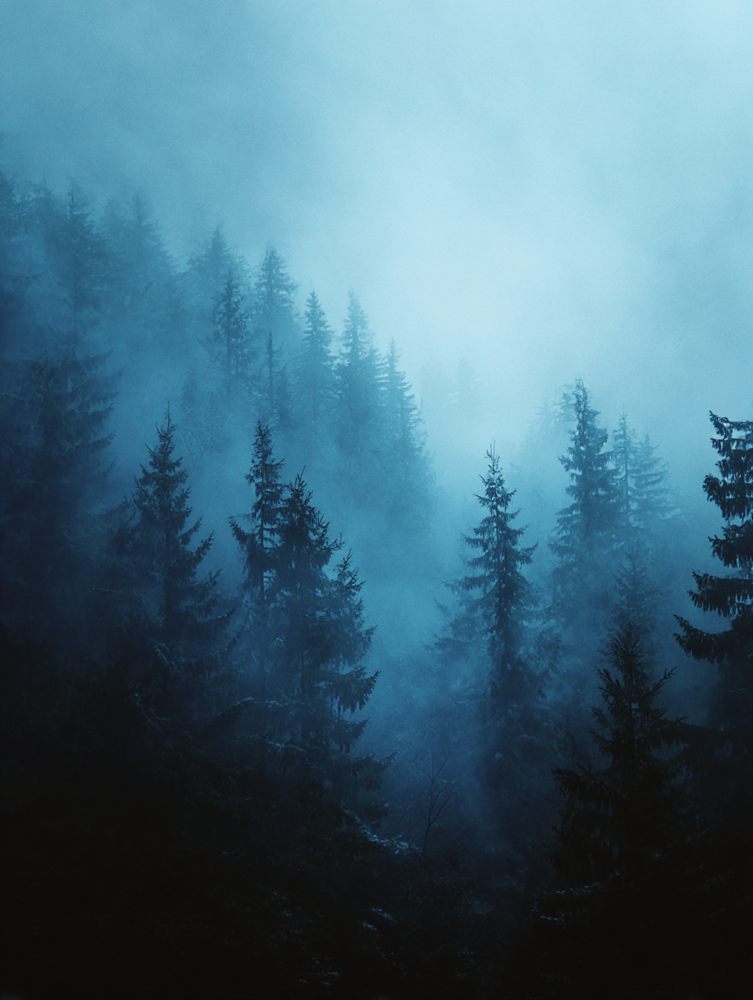

import Spacer from '../../../components/Spacer.astro';

jesse <em>knew</em> in his heart.

he didn’t need to see the blood soaking the frozen pine needles. didn’t need the knife sticking out of noah’s chest, canted at an ugly angle like someone had twisted it hard enough to break something inside.

<Spacer size="lg" />

noah was dead.

there was no mistaking it.

<Spacer size="lg" />

jesse was well and truly alone.

<Spacer size="12xl" />

<Spacer size="lg" />

<Spacer size="6xl" />

the woods were too quiet. not peaceful—the way a cave mouth is quiet, or a grave. sound should have lived here. the brittle snap of wind in the trees, the mutter of snow falling, branches shifting under their own weight.

<Spacer size="lg" />

but it was like everything was holding its breath.

<Spacer size="sm" />

jesse found himself listening for it. the breath. the pause. the way the forest seemed to wait for him to speak first.

<Spacer size="lg" />

<Spacer size="lg" />

he didn’t.

he felt numb. dead inside. terror should have been there. he reached for it, tried to conjure it in the frozen air of his lungs, but it was gone.

just empty.

<Spacer size="lg" />

not peace. but not fear either.

somewhere deep in the pines something creaked. a long, slow sound like wood splitting under strain.

he turned too fast, nearly slipped on the blood-slick snow. caught himself.

eyes straining in the dark.

trees in all directions, standing in judgment.

a light?

for half a second he thought he saw a pale flicker between the trunks. lantern-yellow. then gone.

no wind. breath ghosting in front of him.

the smell of iron and something else. damp earth turned over.

he tried to swallow but his throat felt frozen.

he found himself thinking about the things noah had said on the hike in.

“this place is older than it has any right to be,” noah had muttered.

jesse hadn’t asked what he meant.

he wished he had now.

<Spacer size="2xl" />

<Spacer size="2xl" />

he couldn’t feel his fingers.

he dropped to his knees beside noah, not because he cared but because he felt he should.

noah’s eyes were open.

jesse closed them.

immediately wished he hadn’t.

<Spacer size="3xl" />

somewhere behind him something cracked.

louder. closer.

he spun around, heart pounding, breath finally hitching.

<Spacer size="10xl" />

nothing.

just trees.

just dark.

<Spacer size="3xl" />

just silence waiting to be broken.

he realized he was crying, the tears freezing on his cheeks almost as soon as they formed.

he didn’t know what to do with the body.

didn’t know what to do with himself.

his flashlight was dying.

he turned it off to listen better.

dark.

a sound like breath just beyond the ring of trees.

he strained to hear words.

could have sworn something whispered his name.

<Spacer size="3xl" />

he tried to answer.

no voice came.

the wind picked up then, like it had been waiting for him to fall quiet.

it moaned through the pines, bending them just enough to creak.

<Spacer size="6xl" />

jesse felt something shift under his boots.

soft.

like the forest floor wasn’t solid.

like it might open up if he stayed too long.

he wiped his face with the back of his hand, leaving smears he couldn’t see.

the light flickered again.

this time closer.

he didn’t run.

he didn’t even try.

<Spacer size="6xl" />

he just waited.

<Spacer size="12xl" />