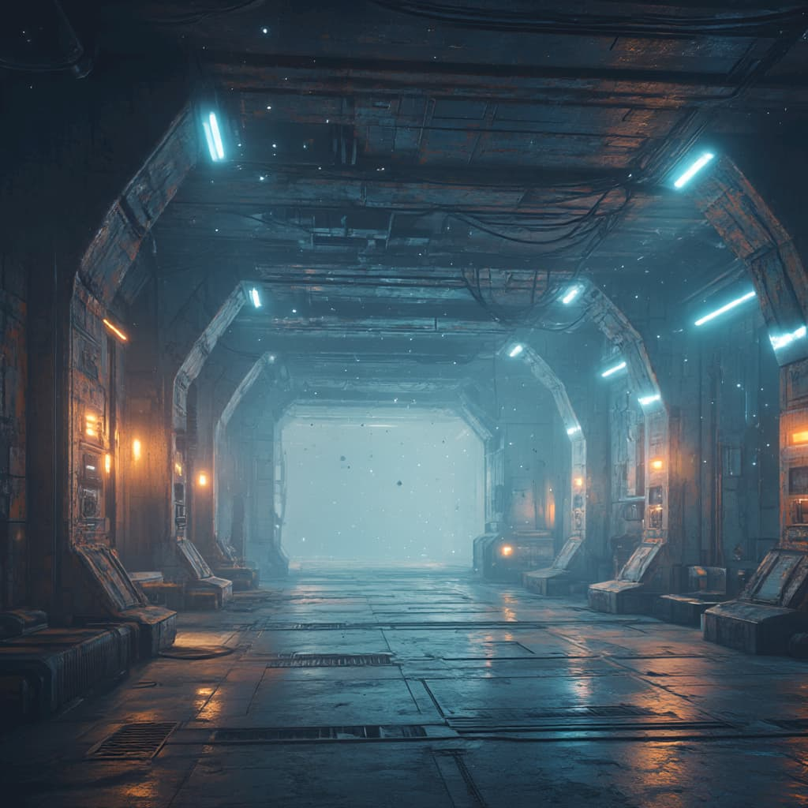
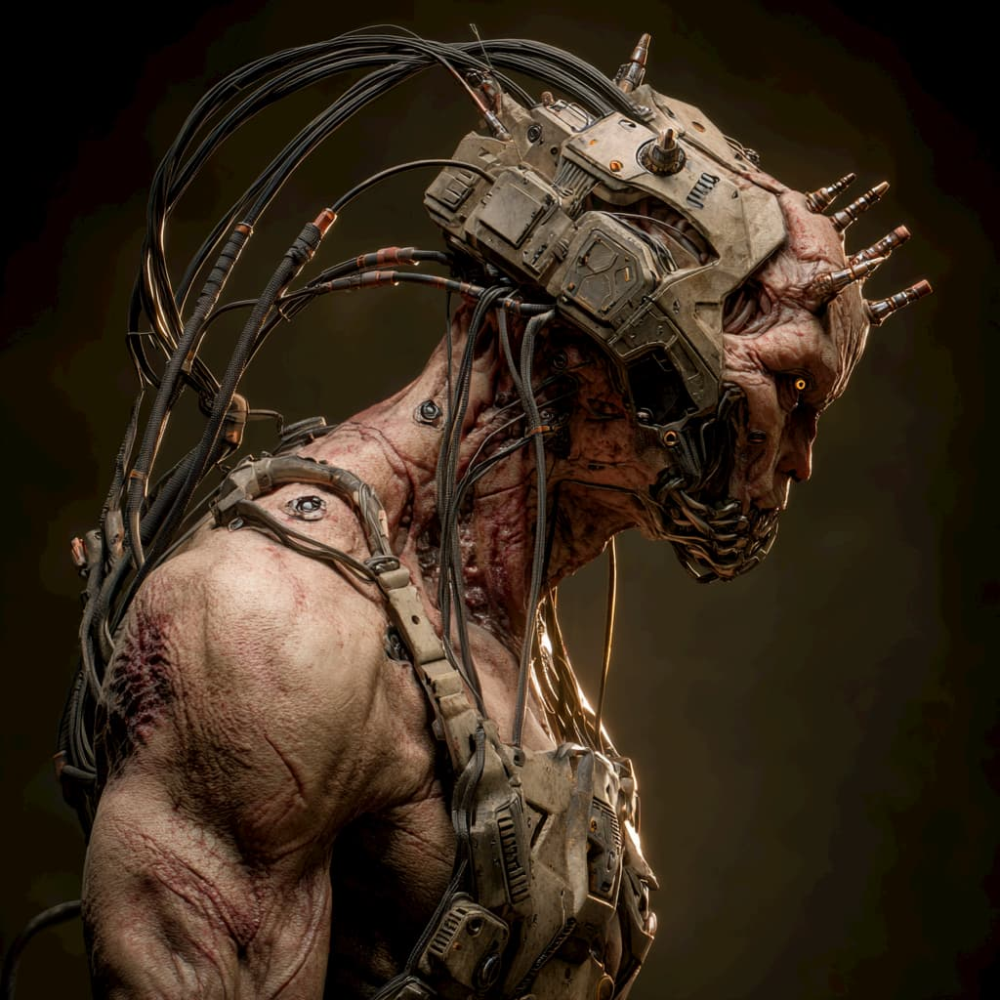
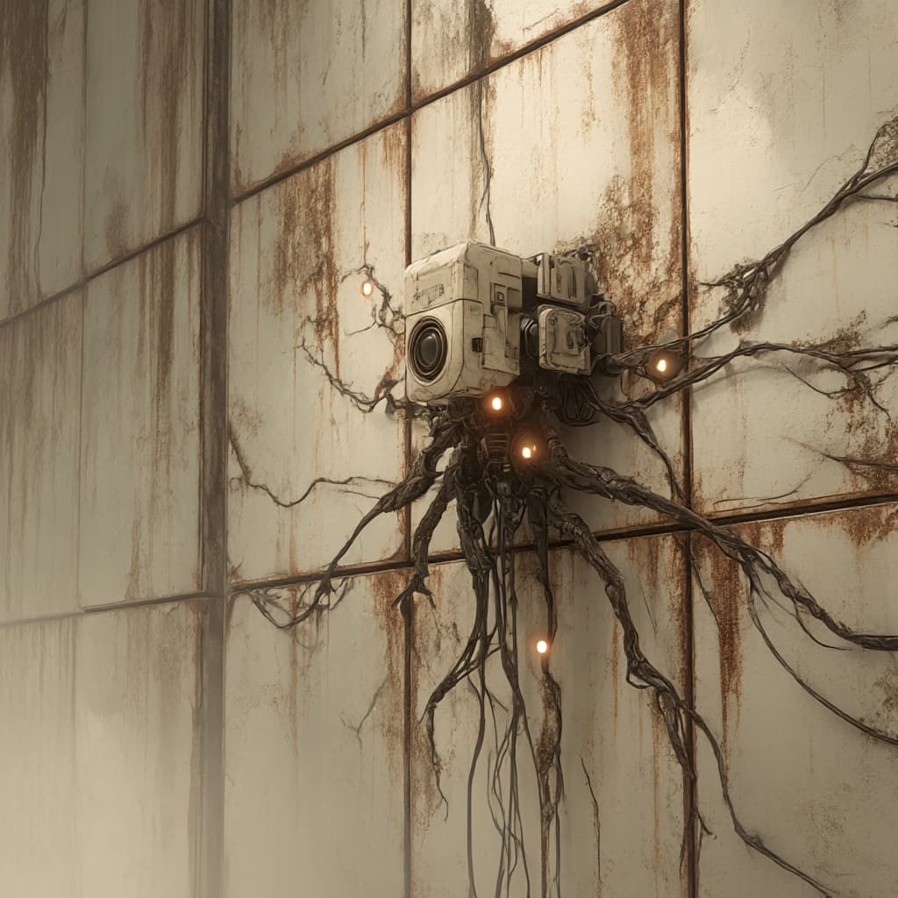
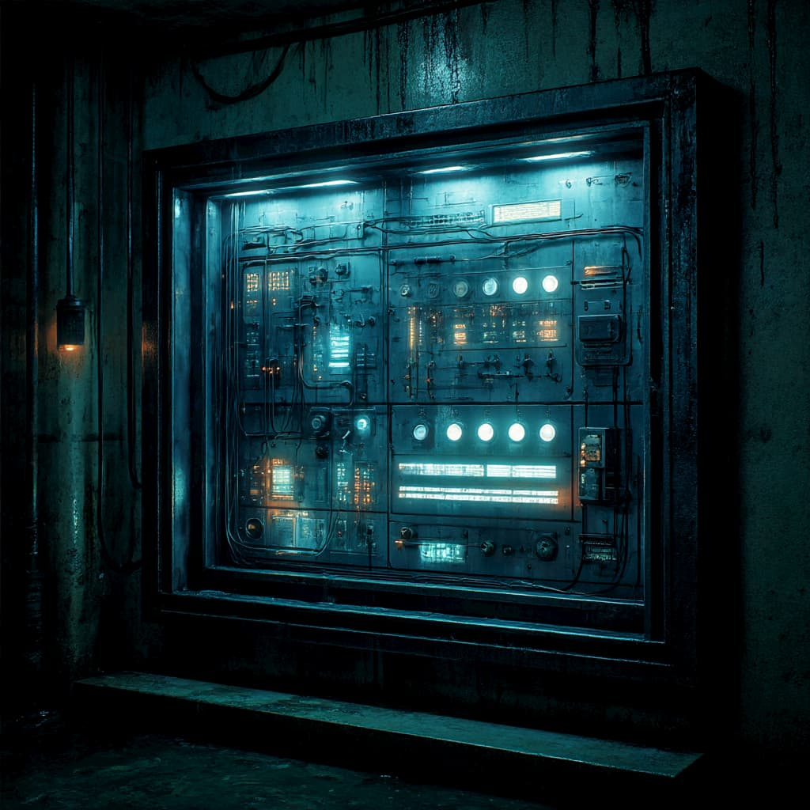
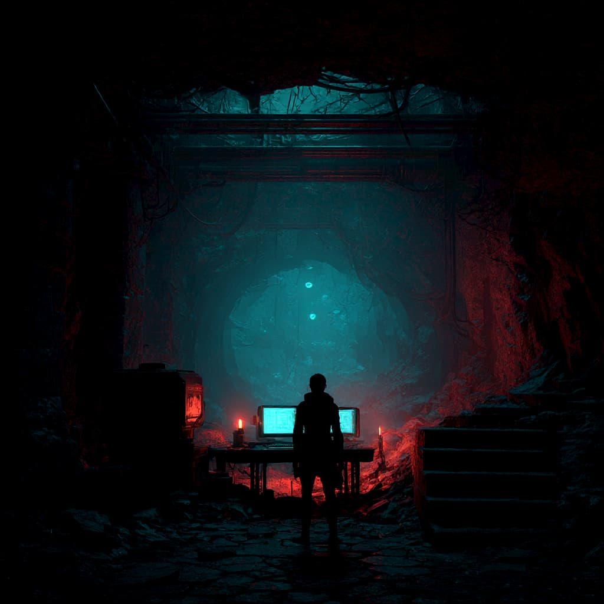

import Spacer from '../../../components/Spacer.astro';
import FadeInLines from '../../../components/FadeInLines.jsx';

<FadeInLines client:visible>
Korrin drifted along a maintenance rail, the magnetized interface pads of his limbs humming in the silence. 

<Spacer size="md" />

The corridor was dark but familiar—one of the older sectors of the outer ring. It hadn’t been maintained in cycles. 

<Spacer size="md" />

Dust motes and drifting flakes of insulation floated around him, caught in the slow centrifugal breath of the station's rotation.
</FadeInLines>

<Spacer size="6xl" />

<FadeInLines client:visible>
<Spacer size="lg" />

<Spacer size="6xl" />
</FadeInLines>

<Spacer size="6xl" />
<FadeInLines client:visible>
He wasn’t alone in this part of the ring. 

Survivors remained—spread thin through the structure like embers in ash. 

He'd glimpsed a few in the last week: a glint of motion behind a bulkhead, a pressure ripple in a nearby corridor, a short-range ping too faint to be an accident. 

But none of them made contact.

None tried to speak. 

Not out loud. 
Not with words. 

They knew better than to cluster. 

Attention was death.
</FadeInLines>

<Spacer size="6xl" />

<FadeInLines client:visible>

<FadeInLines client:visible>
**The Others.**
</FadeInLines>
<Spacer size="6xl" />
</FadeInLines>

<Spacer size="2xl" />

<FadeInLines client:visible>
He thought back to a time before his people and his ship were stranded on this awful prison planet. 

Granted life wasn't always easy back then, but at least it wasn't this. 

What he would give to NOT answer this planets call.
</FadeInLines>

<Spacer size="3xl" />

<FadeInLines client:visible>
The Others didn’t patrol in formation. 

They didn't need to. 

They seeded traps, set listening webs, traced anomalies in temperature and gravity, hunted any pattern that hinted at presence. 
</FadeInLines>

<Spacer size="lg" />

<FadeInLines client:visible>
Too much movement, too much memory-sharing, and you'd find yourself gone—wiped or shredded. If you were lucky.
</FadeInLines>

<FadeInLines client:visible>
Korrin had learned the rhythm of survival. 

Keep to cold zones. 

Never cross the same corridor twice in a day. 

Run silent. 

<Spacer size="lg" />

Shave into smaller processors when you must, but only if you have no other choice.

The more you gave up, the less of you there was to hold onto. He had already forgotten his sister’s name.
</FadeInLines>

<Spacer size="4xl" />
<FadeInLines client:visible>
He found a quiet pocket near a collapsed coolant branch and settled there. He was looking for something. Not a way out—there hadn’t been one for cycles—but maybe somewhere to hide for a time.
</FadeInLines>

<Spacer size="6xl" />

<FadeInLines client:visible>
He dimmed his signature to a single beat every twenty rotations. Just enough for any nearby soul to know he was still here. Still alive. Still trying..
</FadeInLines>

<Spacer size="6xl" />

<FadeInLines client:visible>
The coolant branch had once served a secondary AI core—abandoned now, corrupted beyond safe access. 

He interfaced carefully, using low-band passive pulses to tease at its edge protocols. 

No code injection. 

No overlays. 

Just a presence. 

Just enough to wake it.
</FadeInLines>

<FadeInLines client:visible>
<Spacer size="lg" />

<Spacer size="6xl" />
</FadeInLines>

<FadeInLines client:visible>
Something shifted in the interface. A light blinked. Then another. Old systems waking to a signal they didn’t recognize, but didn’t immediately reject.
</FadeInLines>

<Spacer size="lg" />
<FadeInLines client:visible>
That was enough. A puzzle might be worth more than an answer.
</FadeInLines>

<Spacer size="lg" />

<FadeInLines client:visible>
Korrin rerouted power from his pack into a local repeater array. The signal wouldn't travel far—less than a third of the sector—but it was enough to stir dead zones. Enough to stir memories.
</FadeInLines>

<Spacer size="lg" />
<FadeInLines client:visible>
He waited. Ran idle checks. Traced outlines of old systems in his mind like hands brushing dust from a sculpture. Behind his processes, in the deeper parts of himself, he felt the itch of past shavings—the missing textures of what he used to be. He didn’t mourn them anymore. There wasn’t time.
</FadeInLines>
<Spacer size="lg" />

<FadeInLines client:visible>
Somewhere in the half-functioning array, a string of corrupted characters bloomed and stuttered across the interface. It looked like nothing. But it repeated. And repetition was a kind of will.
</FadeInLines>

<Spacer size="lg" />
<FadeInLines client:visible>
He leaned in closer, his pulse humming through every filament. "Hello?" he whispered—not out loud, but through pulse and pattern.
</FadeInLines>
<Spacer size="lg" />

<FadeInLines client:visible>
The data blinked back—halting, fragmented. He caught only part of it.
</FadeInLines>
<Spacer size="lg" />

<FadeInLines client:visible>
> ".. .... Is anyone else out there? ..."
</FadeInLines>
<Spacer size="lg" />

<FadeInLines client:visible>
He pulled back.

This was not from the ring. The was from somewhere else on the planet. 
</FadeInLines>

<FadeInLines client:visible>
It was someone alive. Someone that used sound waves to communicate. 
</FadeInLines>
<Spacer size="lg" />

<FadeInLines client:visible>
Could it be one of The Young? 
</FadeInLines>
<Spacer size="lg" />
<FadeInLines client:visible>
He had thought all of The Young had been destroyed decades ago by The Others. How had they survived?
</FadeInLines>

<FadeInLines client:visible>
<Spacer size="lg" />

<Spacer size="lg" />
</FadeInLines>

End of Chapter 1.